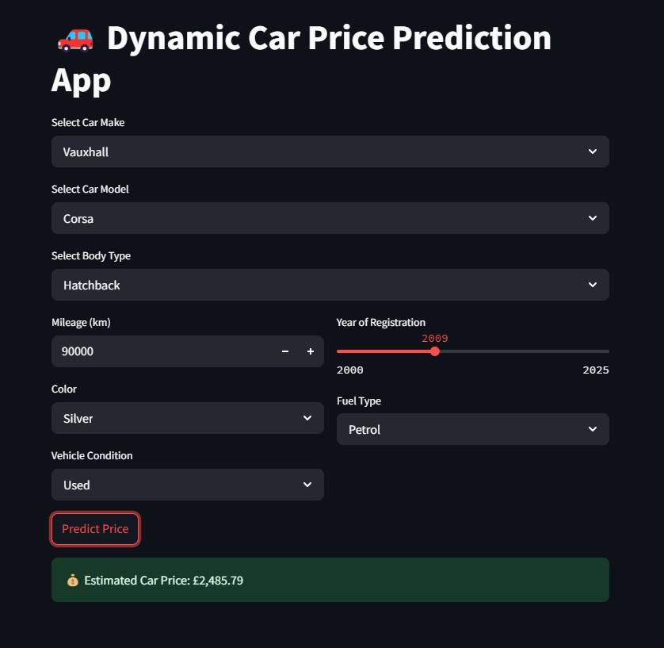
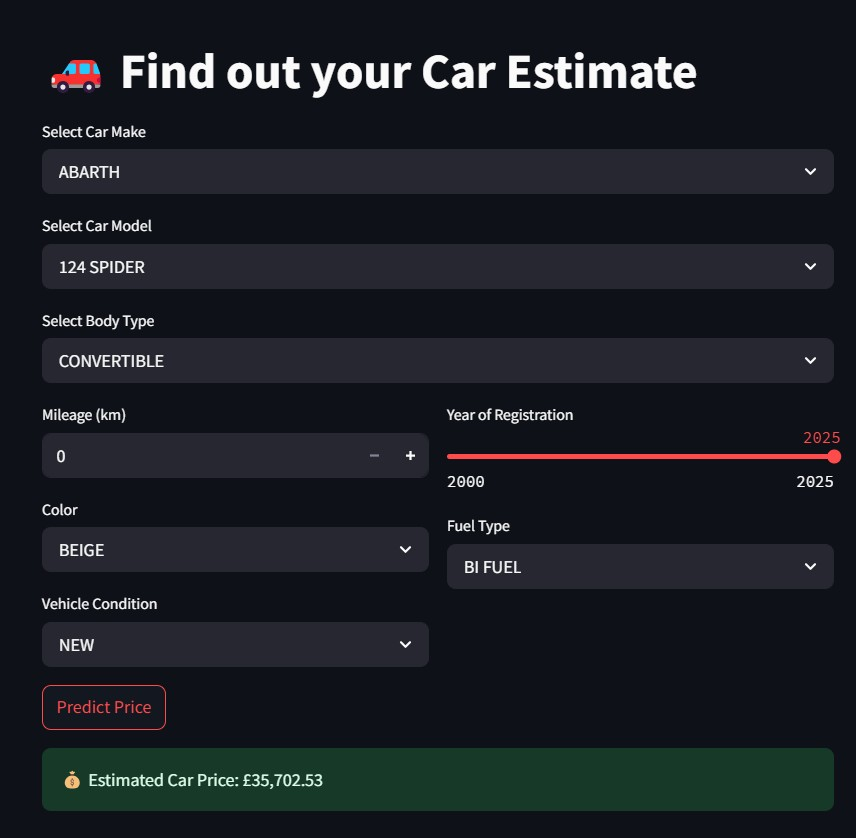

# 🚗 Car Price Prediction App

This project is a **Machine Learning-powered Web App** built with **Streamlit** that predicts the price of a car based on important features such as brand, model, mileage, fuel type, body type, year, and vehicle condition.

The project includes:
- Data preprocessing (cleaning, encoding)
- Model training with hyperparameter tuning (GridSearchCV, 10-fold CV)
- Multiple regressors (Random Forest, XGBoost, Decision Tree, Voting Regressor)
- Automatic selection of the best model
- Model compression for efficient deployment
- Streamlit frontend for interactive user prediction
- Public demo hosted on Streamlit Cloud 🚀

---

## 📸 Demo Screenshot



---

## 🌐 Live Demo (Try it yourself!)

👉 [🔗 Click here to open the Streamlit app](https://adeyemibolaji-car-price-prediction-app-cdthxs.streamlit.app/)

✅ You can test different car combinations and see the predicted price instantly!

---

## 📂 Project Structure

```plaintext
Car_Price_App/
├── car_price_app/
│   ├── generate_dataset.py
│   ├── preprocess_data.py
│   ├── model_training.py
├── data/
│   ├── AutoTrader.csv  # real or synthetic dataset
├── models/
│   ├── *.pkl  # downloaded separately
├── app.py  # Streamlit app
├── download_models.py  # Google Drive downloader for models
├── requirements.txt  # Python dependencies
├── .gitignore
├── README.md

```
---

## 🚀 How to Run Locally

### Install dependencies:

    pip install -r requirements.txt

### Download pretrained models:

    python download_models.py

### Run the Streamlit app:

    streamlit run app.py

✅ The app will open automatically at http://localhost:8501

---

## 🎯 Features Used for Prediction

- Standard Make (e.g., TOYOTA, BMW)
- Standard Model (e.g., COROLLA, 3 SERIES)
- Body Type (e.g., SUV, Sedan, Coupe)
- Fuel Type (e.g., Petrol, Diesel, Electric)
- Vehicle Condition (New or Used)
- Year of Registration
- Mileage
- Standard Colour

---

## 🔥 Machine Learning Models

| Model            | Description                     |
|------------------|---------------------------------|
| Random Forest    | Ensemble of decision trees       |
| XGBoost          | Gradient boosting decision trees |
| Decision Tree    | Single interpretable tree        |
| Voting Regressor | Combined voting of best models   |

✅ All models are hyperparameter-tuned with GridSearchCV and 10-fold Cross Validation.

✅ Models are compressed with joblib to optimize memory usage.

---

## 📈 Evaluation Metrics

Each model is evaluated based on:

- Mean Absolute Error (MAE)
- Root Mean Squared Error (RMSE)
- R² Score

✅ The best model is automatically selected based on R² Score and saved for deployment.

---

## 📥 Model Download

The trained models are stored separately on Google Drive.

✅ Run the provided script:

    python download_models.py

to automatically download and extract models into /models/ before starting the app.

---

## ⚡ Tech Stack

- Python 3.10
- Pandas
- Scikit-learn
- XGBoost
- Streamlit
- Joblib
- GDown (for model download)

---

## ✨ Future Enhancements

- Add SHAP explainability to interpret model predictions
- Allow uploading a CSV of multiple cars for batch prediction
- Add model monitoring and retraining
- Deploy on a faster and better host like Snowflakes for user ease
---

## 👨‍💻 Author

Bolaji Adeyemi  
Passionate about AI, ML, and Building Scalable Intelligent Applications.

[Connect with me on LinkedIn](www.linkedin.com/in/adeyemiqbolaji)

    


